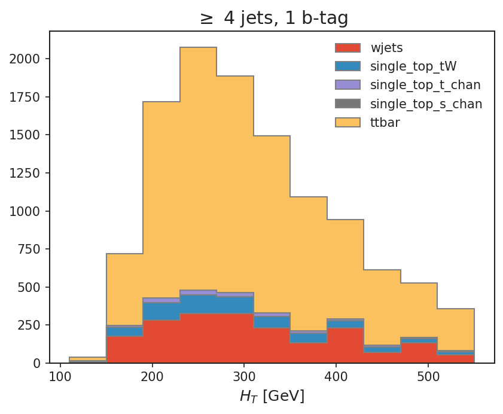
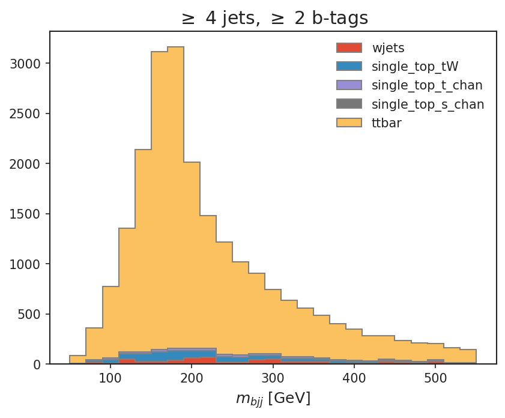
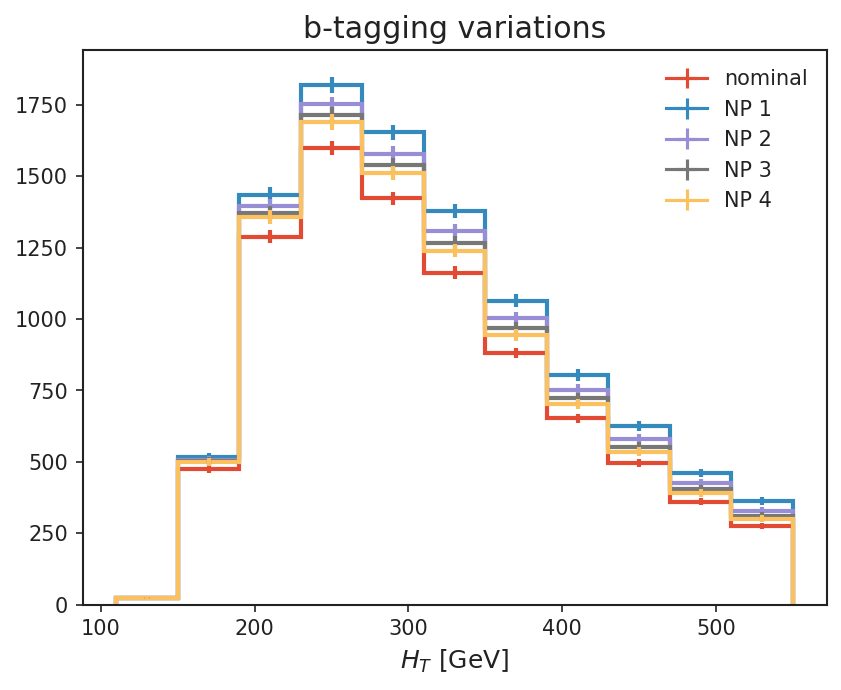
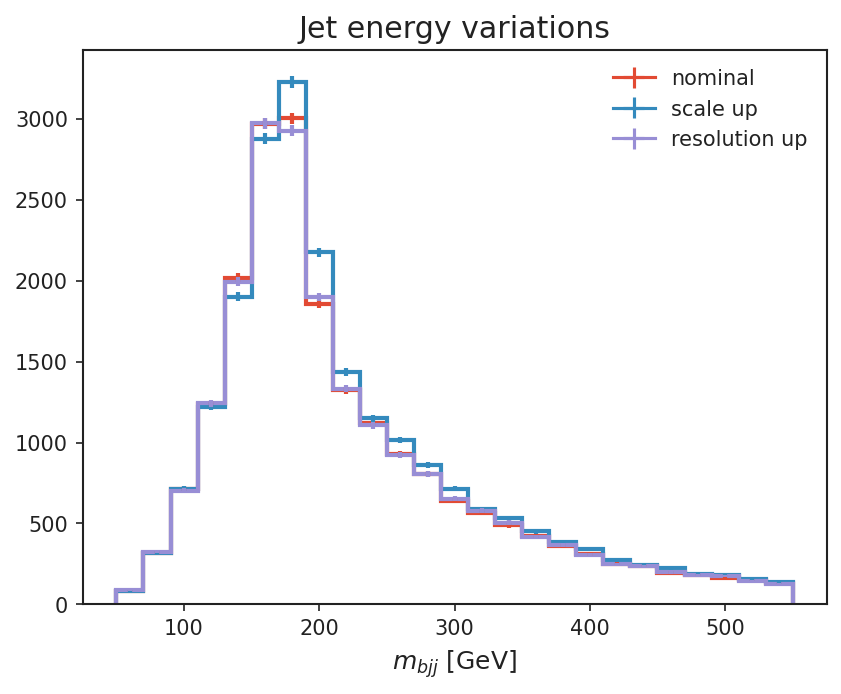

# Plots

- merged: `/home/cms-jovyan/yana_coffea_workflow/agc-dev/workdir/merged.pkl`

## Gallery

### ≥ 4 jets, 1 b-tag (nominal stacked)

`4j1b_nominal_stack.png`

### ≥ 4 jets, ≥ 2 b-tags (nominal stacked)

`4j2b_nominal_stack.png`

### 4j1b ttbar: b-tagging variations

`4j1b_ttbar_btag_variations.png`

### 4j2b ttbar: jet energy variations

`4j2b_ttbar_jet_energy_variations.png`
